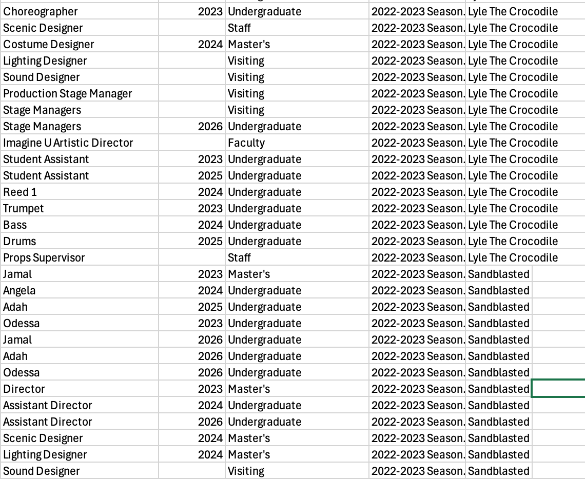

# StackWirtz

This project contains a Python script that processes multiple Excel files from a specified folder, extracts data from all worksheets, and combines them into a single CSV file. The script also prints the name of each Excel file, worksheet, and the first and last name of each actor to the terminal for easy tracking. 



## Prerequisites

- Python 3.6 or higher
- `pandas` library
- `openpyxl` library

## Setup

1. **Clone the repository**:

    ```sh
    git clone https://github.com/yourusername/StackWirtz.git
    cd StackWirtz
    ```

2. **Create and activate a virtual environment**:

    ```sh
    python3 -m venv .venv
    source .venv/bin/activate
    ```

3. **Install the required libraries**:

    ```sh
    pip install pandas openpyxl
    ```

## Usage

1. **Place your Excel files in the `./Inbox` folder**.

2. **Run the script**:

    ```sh
    python stack.py
    ```

3. **Check the `./outbox` folder for the combined CSV file named `wirtz.csv`**.

## Script Details

The script performs the following steps:

1. Initializes an empty DataFrame to hold all data.
2. Loops through all Excel files in the `./Inbox` folder.
3. Reads each Excel file and loops through all its worksheets.
4. Reads each worksheet into a DataFrame and adds columns for the source file and sheet name.
5. Prints the name of the Excel file, worksheet, and the first and last name of each actor to the terminal.
6. Appends the DataFrame to the combined DataFrame.
7. Saves the combined DataFrame to a CSV file in the `./outbox` folder.
